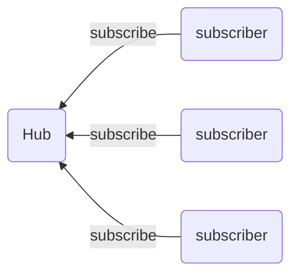
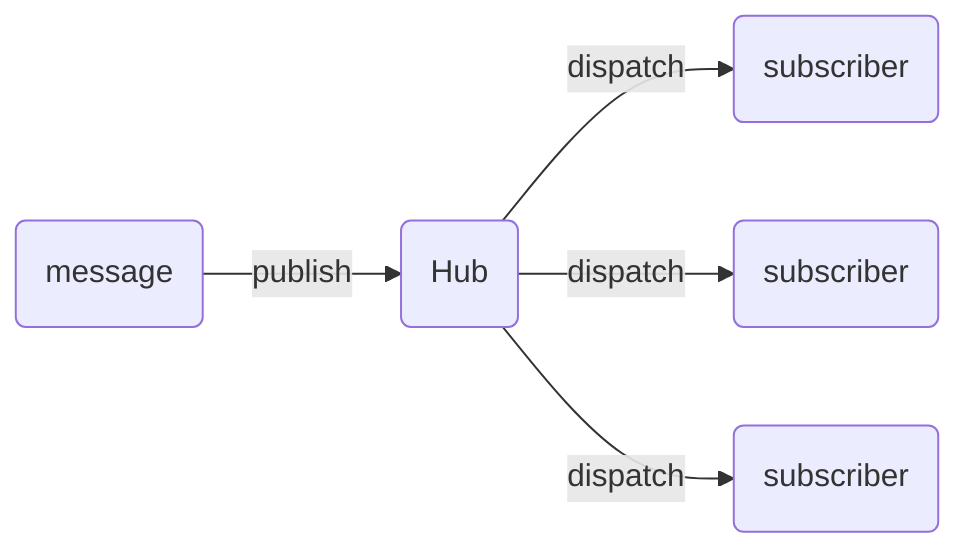
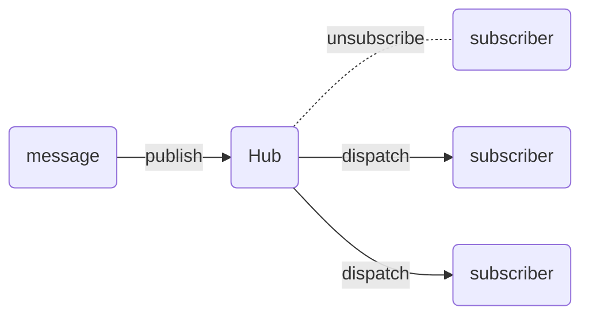

# golang_pub_sub

 - [x] https://www.youtube.com/watch?v=blaYXmmA8zw

## 文章參考

[simple-publish-subscribe-pattern-in-golang](https://blog.wu-boy.com/2022/04/simple-publish-subscribe-pattern-in-golang/) 

## pub/sub 架構

## message flow

## unsubscribe flow

