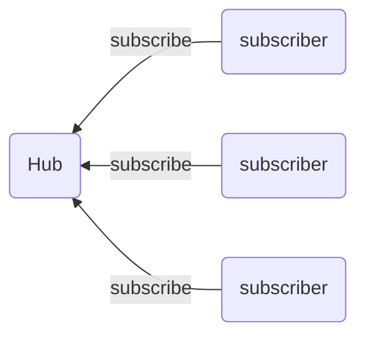
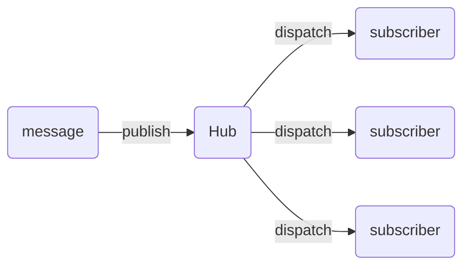
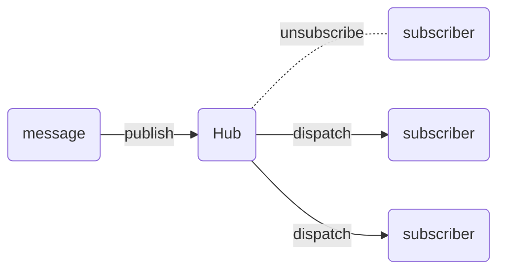

# golang_pub_sub

 - [x] https://www.youtube.com/watch?v=blaYXmmA8zw

## 文章參考

[simple-publish-subscribe-pattern-in-golang](https://blog.wu-boy.com/2022/04/simple-publish-subscribe-pattern-in-golang/)

這個筆記主要是學習透過 golang buffer channel 來實作 pub/sub

## 一般的 pub/sub 


筆者所熟知的 pub/sub 一般來說會有一個 broker 來解隅掉 publisher 對於 subscriber 的依賴

也就是今天 publisher 可以在還沒有 subscriber 的狀態下先發佈

subscriber 指針對 broker中來做訂閱

不一定是有 publisher 才能做訂閱

## pub/sub 架構

從參考文章看到的 pub/sub 架構如下



這邊的 Hub 就筆者理解是 broker 的角色 

subscriber 透過 hub 來註冊要訂閱功能

## 結構分析

Hub 結構會有紀錄每個 subscriber reference 的 map

還有一個 mutex 用來避免 race condition

需要先實作 Hub 結構來方便對 subscriber 做 subscribe 與 unsubscribe

Hub 實作如下:

```go=
type Hub struct {
    sync.Mutex
    subs map[*subscriber]struct{}
}
```

Subscriber 需要可以接收來自 Hub 的訊息

這邊可以透過 byte 陣列的 channel 來接收訊息

而因為需要可以接收 cancel 以及 Unsubscribe 的通知所以可以透過 一個空結構的 channel 來做這件事情 

Subscriber 結構如下:

```go=
type Message struct {
    Data []byte    
}
type Subscriber struct{
    sync.Mutex

    name    string
    handler chan *Message
    quit    chan struct{}
}

```

## 功能分析

Subscriber 主要功能是不斷接收 hub 傳過來的功能

所以可以透過實作一個 run function 來不斷接收 handler channel 的訊息

```go=
func (s *subscriber) run(ctx context.Context) {
    for {
        select {
        case msg := <-s.handler:
            log.Println(s.name, string(msg.Data))
        case <-s.quit:
            return
        case <-ctx.Done():
            return
        }
    }
}
```

透過 select 來接收 handler, quit 還有 ctx cancel的訊息

提供一個 publish 來讓 Hub 資料傳輸到 handler channel

```go=
func (s *subscriber) publish(ctx context.Context, msg *Message) {
	select {
	case <-ctx.Done():
		return
	case s.handler <- msg:
	default:
	}
}
```
要注意的是 select 是 non block 操作，所以只有有值才會接的到

這代表如果 buffer channel handler size 無法負擔 hub 傳送頻率的話

會有漏接訊息的問題，需要思考一下如何有效調整 size

建立 subscriber 的 method

```go=
func NewSubscriber(name string) *subscriber {
	// log.Println(name)
	return &subscriber{
		name:    name,
		handler: make(chan *Message, 100),
		quit:    make(chan struct{}),
	}
}
```

Hub 的部份

主要功能是

1. 註冊 subscriber

```go=
// 訂閱 新增 subscriber
func (h *Hub) Subscribe(ctx context.Context, s *subscriber) error {
	h.Lock()
	h.subs[s] = struct{}{}
	h.Unlock()

	// handler context cancel
	go func() {
		select {
		case <-s.quit:
		case <-ctx.Done(): // cancel
			h.Lock()
			delete(h.subs, s)
			h.Unlock()
		}
	}()
	go s.run(ctx)
	return nil
}
```
2. 註銷 subscriber 並且關閉 channel 通知 subscriber 不用繼續接收
```go=
func (h *Hub) Unsubscribe(ctx context.Context, s *subscriber) error {
	h.Lock()
	delete(h.subs, s)
	h.Unlock()
	close(s.quit)
	return nil
}
```

建立 Hub

```go=
func NewHub() *Hub {
	return &Hub{
		subs: map[*subscriber]struct{}{},
	}
}

```

## message flow



## unsubscribe flow



## 根據 flow 寫主要訂閱邏輯

```go=

func main() {
	ctx := context.Background()
	h := hub.NewHub()
	sub01 := hub.NewSubscriber("sub01")
	sub02 := hub.NewSubscriber("sub02")
	sub03 := hub.NewSubscriber("sub03")

	h.Subscribe(ctx, sub01)
	h.Subscribe(ctx, sub02)
	h.Subscribe(ctx, sub03)
	_ = h.Publish(ctx, &hub.Message{Data: []byte("test01")})
	_ = h.Publish(ctx, &hub.Message{Data: []byte("test02")})
	_ = h.Publish(ctx, &hub.Message{Data: []byte("test03")})
	time.Sleep(1 * time.Second)

	h.Unsubscribe(ctx, sub03)
	_ = h.Publish(ctx, &hub.Message{Data: []byte("test04")})
	_ = h.Publish(ctx, &hub.Message{Data: []byte("test05")})
	time.Sleep(1 * time.Second)
}
```

## 透過 goleak 來寫除了基本測試之外，檢測程式是否會有 memory leak

```go=

func TestMain(m *testing.M) {
	goleak.VerifyTestMain(m)
}

func TestSubscriber(t *testing.T) {
	ctx := context.Background()
	h := hub.NewHub()
	sub01 := hub.NewSubscriber("sub01")
	sub02 := hub.NewSubscriber("sub02")
	sub03 := hub.NewSubscriber("sub03")

	h.Subscribe(ctx, sub01)
	h.Subscribe(ctx, sub02)
	h.Subscribe(ctx, sub03)

	assert.Equal(t, 3, h.Subscribers())
	h.Unsubscribe(ctx, sub01)
	h.Unsubscribe(ctx, sub02)
	h.Unsubscribe(ctx, sub03)

	assert.Equal(t, 0, h.Subscribers())
}

func TestCancelSubscriber(t *testing.T) {
	ctx := context.Background()
	h := hub.NewHub()
	sub01 := hub.NewSubscriber("sub01")
	sub02 := hub.NewSubscriber("sub02")
	sub03 := hub.NewSubscriber("sub03")

	h.Subscribe(ctx, sub01)
	h.Subscribe(ctx, sub02)
	ctx03, cancel := context.WithCancel(ctx)
	h.Subscribe(ctx03, sub03)

	assert.Equal(t, 3, h.Subscribers())

	// cancel subscriber 03
	cancel()
	time.Sleep(100 * time.Millisecond)
	assert.Equal(t, 2, h.Subscribers())

	h.Unsubscribe(ctx, sub01)
	h.Unsubscribe(ctx, sub02)

	assert.Equal(t, 0, h.Subscribers())
}
```